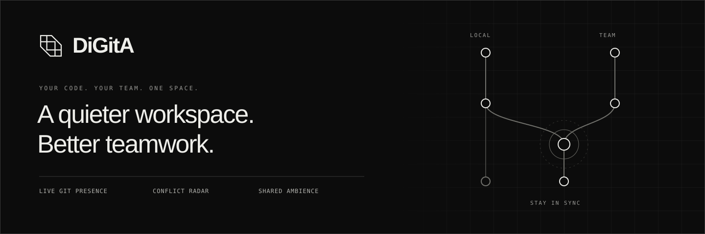
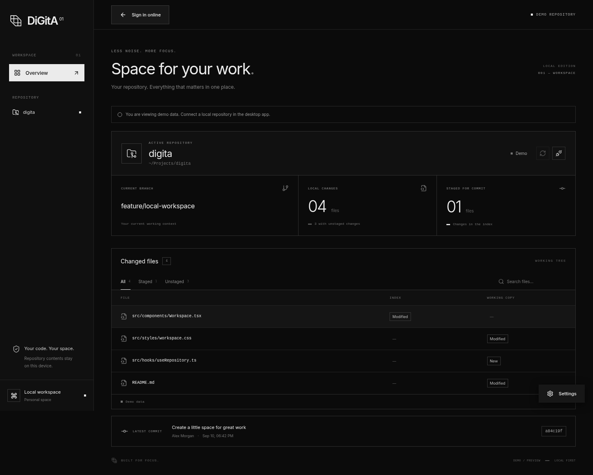

DiGitA is a Tauri desktop workspace for local Git activity and team collaboration.
Team rooms provide online presence and early warnings when people edit the same file. Repository contents stay on your machine; sharing Git
metadata is opt-in. Local Git browsing works without an account.

The project is a **0.2.0 release candidate**, with Arch Linux x86_64 as the current
distribution priority. Settings, first-launch recovery and remembered local
projects/preferences, team administration, profile editing, sidebar team switching
and bounded local Git tracking are implemented. Native pilot checks and
clean-install validation are still open. See the [validation records](docs/README.md#design-and-validation).

## Start developing

Requirements: Node.js 22+, npm, Git, and Rust/Cargo with the
[Tauri system prerequisites](https://v2.tauri.app/start/prerequisites/).

```sh
npm ci
npm run tauri dev
```

The client defaults to `http://127.0.0.1:8000`. Follow the
[backend setup](backend/README.md#run-locally) to start a local API, or configure
`VITE_API_URL` in the root `.env` for your backend. Use **Local mode** on the login
screen to work without a server.

For a browser preview, run `npm run dev` and open `http://127.0.0.1:1420`.
Real repository access requires the desktop app. Run the browser preview and
desktop development server separately because both use port 1420.

## Where to find things

| Path                         | Purpose                                                |
| ---------------------------- | ------------------------------------------------------ |
| `src/App.tsx`              | Local Git workspace                                    |
| `src/DesktopApp.tsx`       | Sign-in, team dashboard, room navigation               |
| `src/components/`          | Settings, introduction, radar drawer, request feedback |
| `src/hooks/`               | Repository polling, room connection, request state     |
| `src/lib/`                 | HTTP API, credentials, native Git access and demo data |
| `src/i18n/`                | Language state and Czech translations                  |
| `src/styles/`              | Application styles                                     |
| `src-tauri/`               | Native Rust shell and desktop configuration            |
| `crates/git-presence/`     | Standalone Git inspection library                      |
| `backend/`                 | FastAPI, database migrations and API tests             |
| `e2e/`                     | Playwright browser scenarios                           |
| `website/`                 | Public website source                                  |
| `docs/`                    | Documentation and published GitHub Pages website       |
| `scripts/`, `packaging/` | Cleanup and release tooling          |

Frontend tests live beside the code they verify. The [code map](docs/codebase.md)
explains the main entry points and data flow.

## Common commands

```sh
npm test                 # Frontend tests
npm run build            # TypeScript check and frontend build
npm run test:git         # Rust Git tests
npm run test:e2e         # Browser tests; requires the backend environment
npm run clean            # Remove generated output and Python caches
```

`clean` removes `artifacts/`, including local packages and screenshots. It preserves
installed dependencies, Rust build caches, `.env` files, databases, private notes,
and the published website in `docs/`. Stop development servers before cleaning.

## Documentation

- [Start the Codex team with `npm run codex`](docs/coordination.md)
- [Documentation index](docs/README.md)
- [Detailed setup, behavior and troubleshooting](docs/development.md)
- [Backend API and configuration](backend/README.md)
- [Arch Linux build and installation](docs/arch-linux.md)
- [Website editing and publishing](website/README.md)
- [Security review and deployment conditions](docs/security-review.md)



DiGitA uses [MIT](LICENSE). See the [0.2.0 exit checklist](docs/checklist-0.2.0.md)
for completed checks and remaining native/release gates.
