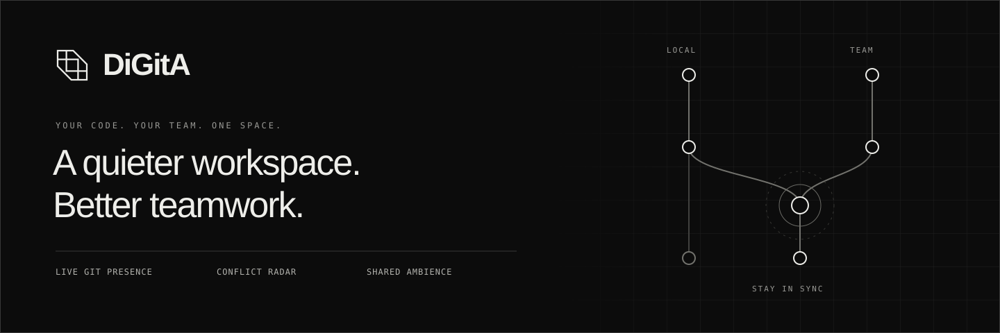
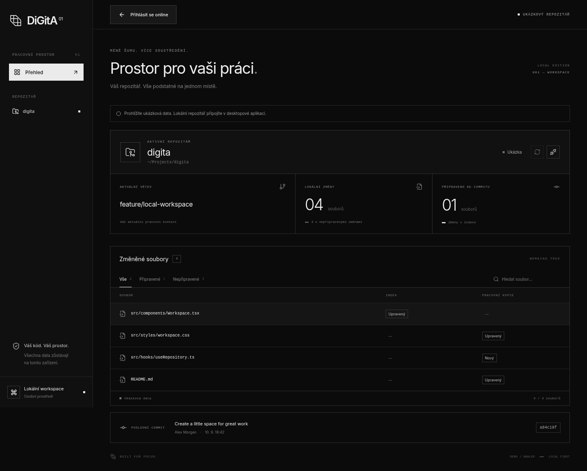
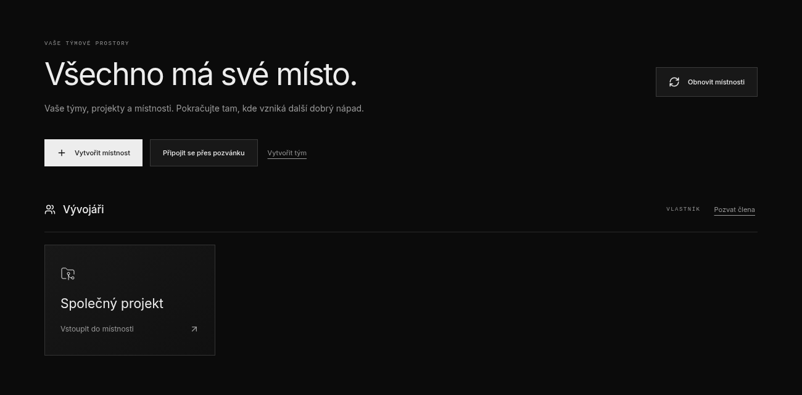
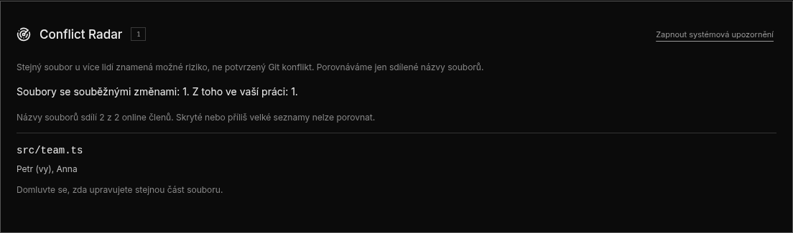
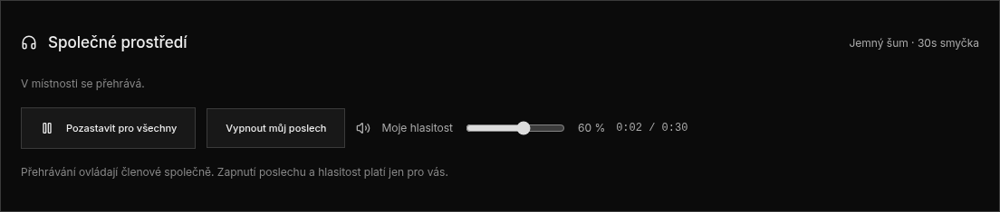
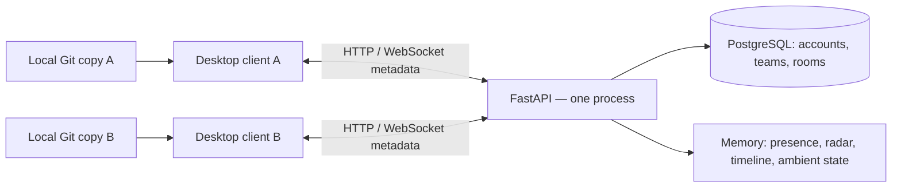

<p align="center">
  A desktop home for your team's work — before the next push.<br />
  Live Git activity, early conflict warnings, and a shared space to focus.
</p>

<p align="center">
  <a href="#screenshots">Screenshots</a> ·
  <a href="#getting-started">Get started</a> ·
  <a href="#roadmap">Roadmap</a> ·
  <a href="backend/README.md">Backend docs</a>
</p>

<p align="center">
  <code>Tauri 2</code> &nbsp; <code>React</code> &nbsp; <code>Rust</code> &nbsp;
  <code>FastAPI</code> &nbsp; <code>PostgreSQL</code>
</p>

---

| See work as it happens                                                         | Catch overlaps early                                              | Find your focus                                             |
| ------------------------------------------------------------------------------ | ----------------------------------------------------------------- | ----------------------------------------------------------- |
| Share permitted Git metadata with your room, while code stays on your machine. | See when teammates change the same file, before a commit or push. | Listen to a synchronized ambient loop with your own volume. |

## Screenshots

Actual application UI, captured in the browser with demo/test accounts and
repositories. The interface is currently in Czech. Click any image for full size.

### Your local workspace

Branch, latest commit, and working-tree changes in one view, with search and
staged/unstaged filters.

[](docs/images/workspace.png)

<details>
<summary><strong>Explore team rooms, Conflict Radar, and shared ambience</strong></summary>

### Your team's spaces

Create a team, join through an invitation, and pick up work in a project room.

[](docs/images/dashboard.png)

### A heads-up before the merge

Conflict Radar identifies overlapping file paths and the people working on them.
It highlights possible risk; it does not claim a Git merge conflict is certain.

[](docs/images/conflict-radar.png)

### A shared atmosphere, your own volume

Room-wide play/pause with personal listening controls and independent volume.

[](docs/images/ambient.png)

</details>

## Project status

**Phases 1–5 implemented for the local prototype: Git workspace, accounts, live collaboration, Conflict Radar, and ambient rooms.**

The desktop includes registration/login, a dashboard of teams and rooms, invitations, online presence, optional Git metadata sharing, and a live timeline. The local Git workspace remains available without signing in. The native application passes `cargo check`, builds, and displays its interface on Arch Linux with Wayland.

FastAPI provides accounts, team permissions, single-use invitations, and authenticated WebSocket rooms. PostgreSQL stores account/team data; active presence, conflict warnings, ambient playback, and the last 100 room events live in server memory. Validation is described below.

The current application UI is in Czech. Release preparation is the next planned phase.

## Current features

- Register and log in, optionally remembering the desktop session in the OS credential store.
- Create teams and rooms, invite colleagues, and switch rooms from the main dashboard.
- See online room members, their permitted Git metadata, and a live activity timeline.
- Enable sharing explicitly, with independent controls for branch names, file names, and commit messages.
- Reconnect after network interruptions and receive the room's current state.
- Detect shared file paths changed by multiple online members, with live warning removal and optional desktop notifications.
- Listen to a bundled ambient loop with shared play/pause, personal volume, and reconnect synchronization.
- Select a local Git repository through a native directory picker and disconnect it at any time.
- View the current branch, latest commit, and changed files.
- Distinguish staged and unstaged changes, search paths, and filter the file list.
- Refresh manually or automatically two seconds after the previous read completes.
- Handle empty repositories, detached HEAD, linked worktrees, renames, and existing merge conflicts.
- Keep the last known snapshot visible during read errors and retry automatically.
- Explore an explicitly labeled browser demo without connecting a repository.

## Roadmap

### Desktop navigation

After login, the main dashboard lists the user's accessible rooms grouped by
team, with actions to create a room, create a team, accept an invitation, and enter
a room. Room creation follows team permissions. An empty dashboard offers
team creation or invitation acceptance.

The local Git overview is part of the selected room's workspace,
alongside members, activity, Conflict Radar, and ambient audio. Users can
return to the dashboard to switch rooms. In this UX, a "server" means a team space;
selecting multiple backend hosts is a separate future feature.

| Phase | Focus                | Planned outcome                                                                                        | Status      |
| ----- | -------------------- | ------------------------------------------------------------------------------------------------------ | ----------- |
| 1     | Local prototype      | Desktop window, repository selection, Git overview, automatic refresh, and native validation           | Complete    |
| 2     | Backend and accounts | FastAPI service, database schema, registration, authentication, teams, and rooms                       | Complete    |
| 3     | Live collaboration   | WebSocket connection, online presence, shared Git metadata, and a project event timeline               | Complete    |
| 4     | Conflict Radar       | Detect overlapping file changes, update warnings, add notifications, and suppress duplicate alerts     | Implemented |
| 5     | Ambient rooms        | One licensed audio track, synchronized playback, individual volume, and reconnect recovery             | Implemented |
| 6     | Release readiness    | Broader automated testing, Docker Compose, CI, installers, documentation, and the first public release | Planned     |

Future ideas include GitHub/GitLab integrations, pull request and CI status,
multiple ambient layers, editor plugins, and self-hosted servers. The UX backlog
also includes switching among multiple local projects, profile customization,
an administration dashboard, text/voice channels, and Git history/branch controls.
These additions are not part of the implemented phases; Git remains read-only.

### MVP target

Two users should be able to join the same room, connect separate working copies of the same repository, see each other's branch and local activity, receive warnings when they edit the same file, and listen to synchronized ambient audio. Each user must be able to disable file-name sharing.

Conflict Radar indicates potential overlap; it does not guarantee that Git will produce a merge conflict or resolve conflicts automatically.

## Technology

| Area               | Technology                              | Status                                           |
| ------------------ | --------------------------------------- | ------------------------------------------------ |
| Desktop shell      | Tauri 2 and Rust                        | Build and window startup verified on Arch Linux  |
| Interface          | React, TypeScript, Vite, Lucide         | Implemented                                      |
| Git integration    | Git CLI through a standalone Rust crate | Implemented; six Rust tests passed               |
| Frontend testing   | Vitest and Testing Library              | Implemented                                      |
| Browser testing    | Playwright and Chromium                 | Implemented                                      |
| Backend            | Python and FastAPI                      | Implemented; includes conflict lifecycle tests   |
| Database           | PostgreSQL and Alembic                  | Implemented; migrations verified                 |
| Realtime transport | WebSocket                               | Implemented; authenticated room connections      |
| Local persistence  | SQLite                                  | Planned                                          |
| Infrastructure     | Docker Compose and GitHub Actions       | Local PostgreSQL Compose implemented; CI planned |

## How the pieces connect



Each member keeps their own repository and uses their normal Git remote to
exchange code. DiGitA does not upload or synchronize repository contents.
The future public portfolio/download website is separate from the collaboration
API; that API must remain reachable while people use shared rooms.

## Getting started

### Requirements

- Node.js 22 or newer and npm.
- Git installed and available on `PATH`.
- Rust and Cargo for the desktop application and Git tests.
- Python 3.12+, uv, and Docker Compose for the collaboration backend.
- The [Tauri system prerequisites](https://v2.tauri.app/start/prerequisites/) for your operating system.

On Arch Linux, install the native dependencies with:

```sh
sudo pacman -S --needed rust webkit2gtk-4.1 base-devel librsvg openssl curl wget file xdotool libappindicator-gtk3
```

### Desktop application

From the project root:

```sh
npm ci
npm run tauri dev
```

Keep the desktop command running in a separate terminal from the backend.
Start the backend below for collaboration, then register or log in. Create a team
and room, enter it, and choose **Připojit repozitář** (Connect repository). Each
member selects their own working copy and confirms it belongs to the room before
enabling sharing. A room represents one logical project; remote URLs are not
automatically matched. Change the sharing checkboxes to permit individual fields.

For offline use, choose **Lokální režim** (Local mode) on the login screen.
Use **Přihlásit se online** in the workspace header to return to login, or
**Zpět do týmového prostoru** if you are already signed in. On the dashboard,
**Obnovit místnosti** reloads your teams, rooms, and permissions.
Selecting a repository subdirectory also works. Edit a file in your usual editor
and the overview refreshes automatically. Changing rooms or repositories resets
sharing consent. Linux session persistence requires an unlocked Secret Service
keyring; leave **Zapamatovat přihlášení** unchecked to use an in-memory session.

### Browser preview

```sh
npm ci
npm run dev
```

Open `http://127.0.0.1:1420`. Login and rooms use the running backend. For the
static Git demo, choose **Lokální režim**, then **Prohlédnout ukázku** (View demo).
Access to a real local repository requires the desktop application. The eventual
public website will be a separate product page with download links.

Stop the standalone preview server before running `npm run tauri dev`; both use port 1420.

### Ambient room (Phase 5)

Each live room includes **Společné prostředí** with a bundled 30-second soft-noise
loop. Any current room member can use **Přehrát pro všechny** or
**Pozastavit pro všechny**. Playback starts paused, and each person must separately
choose **Zapnout můj poslech** to hear it. **Moje hlasitost** changes only that
client's volume (initially 25%). Listening and volume reset when leaving the room.

The server sends playback metadata, never audio streams. The WAV is included in
the desktop build, generated from scratch by `scripts/generate_ambient.py`, and
dedicated to CC0; see [audio provenance and license](public/audio/LICENSE.txt).
No external audio service or API key is required.

The server measures elapsed time with a monotonic clock. Clients anchor each
snapshot to their own monotonic clock and refresh timing through the 15-second
heartbeat, with a bounded half-round-trip latency estimate. Local playback is
checked every second and resynchronized when drift exceeds 350 ms. This is
approximate ambient synchronization, not sample-accurate playback; networking,
WebView scheduling, and audio devices affect the result.

A lost connection pauses local audio. Reconnection restores the latest room
position and resumes opted-in listeners if the room is playing. Leaving stops
sound. The last accepted command wins; changes closer than 500 ms are ignored
to limit flapping. State resets after the last member leaves or the server restarts.

For a two-device check: join the same room, enable listening on both devices,
start playback, change one listener's volume, pause from the other device, and
then test a disconnect/reconnect. Restart a running backend to load Phase 5.
Actual sound output and autoplay behavior in Linux/Windows desktop WebViews
still require this manual check; automated playback checks use Chromium.

### Conflict Radar (Phase 4)

Open the same room using two different accounts and connect each account's local
working copy. Enable Git sharing and **Názvy souborů** on both clients. Change the
same relative path in both working copies: the radar lists the path and members
after the next Git refresh. No commit or push is required. Remove one change or
disable file sharing: the warning disappears. Leaving, revocation, and network
loss also remove the affected live state; a disappeared warning does not prove
that a merge conflict was resolved.

Comparison uses exact, case-sensitive Git paths across all branches in one room.
Renames share both old and new paths, without increasing the changed-file count.
Hidden lists and oversized payloads cannot participate; the UI shows how many
online members are sharing comparable lists. No code, diff, PR analysis, or
ahead/behind analysis is involved.

Warnings are live room state, not database records. Historical `conflict.detected`
and `conflict.resolved` events contain no paths or participant lists. Each event
type is batched and limited to once per 30 seconds per room; the live warning list
always updates immediately, even when a timeline event is suppressed.

**Zapnout systémová upozornění** enables native notifications for the current room
visit after an OS permission check. Notifications concern only the current user's
new overlaps, contain no file/member/project names, wait 1.5 seconds to group bursts,
and occur at most once per 30 seconds. Resolved or withdrawn warnings cancel pending
notifications. Reconnection establishes a new baseline without replaying existing
warnings. In-app warnings remain available when notifications are disabled or fail.

Native notification delivery depends on the OS notification service. Windows
release validation should use an installed application; development notifications
can use PowerShell branding. See the [Tauri notification plugin documentation](https://v2.tauri.app/plugin/notification/).
Real OS delivery on Linux and an installed Windows build remains a manual release
check; automated frontend tests mock the notification boundary.

### Backend and accounts

With Python 3.12+, uv, and Docker Compose installed, run from the project root:

```sh
docker compose up -d --wait db
cd backend
uv sync --locked
# First setup only: copy the example if backend/.env does not already exist.
cp .env.example .env
uv run alembic upgrade head
uv run uvicorn digita_api.main:create_app --factory --host 127.0.0.1 --port 8000 --no-proxy-headers --ws-max-size 65536
```

Check `http://127.0.0.1:8000/health` for `{"status":"ok"}`. The root `/` and
`/favicon.ico` have no handlers; their 404 responses are expected.
Open `http://127.0.0.1:8000/docs` to register, log in, create a team and room, and
invite a second account. See [backend setup and API workflow](backend/README.md)
for permissions, configuration, security choices, and PostgreSQL test instructions.
From `backend/`, run `uv run pytest -q` for the isolated SQLite test suite.

### Configuration files

| Location                                         | Purpose                                                                                                                   |
| ------------------------------------------------ | ------------------------------------------------------------------------------------------------------------------------- |
| Root `.env` (optional; copy root `.env.example`) | `VITE_API_URL`, default `http://127.0.0.1:8000`; restart Vite or rebuild the desktop after changing it                    |
| `backend/.env` (copy `backend/.env.example`)     | Database connection, session/invitation lifetimes, rate limits, and trusted origins; run backend commands from `backend/` |

`VITE_*` values are public frontend build configuration: never put passwords or
private API keys there. Real `.env` files, private keys, local databases, and
backups are ignored; example files intentionally remain tracked. The Compose
password is a public local-development default, not a production secret.
Ignoring a path does not remove an already tracked file or secrets in Git history.

An API on another host requires HTTPS/WSS, permitted frontend origins on the
backend, and matching `connect-src` entries in `src-tauri/tauri.conf.json`.
For local VM testing, use the tunnel below and retain the default loopback URL.

### Windows VM test with a Linux backend

Use two different accounts and two separate working copies of the same project.
A VM on the same computer is sufficient for this development check.

1. Start PostgreSQL and the backend on Linux using the commands above. Ensure
   the Linux host's SSH server is running and reachable from the VM.
2. In Windows **PowerShell**, replace `LINUX_HOST` with the host's reachable IP
   or hostname, and `LINUX_USER` with its SSH account:

   ```powershell
   Test-NetConnection LINUX_HOST -Port 22
   ssh -N -o ExitOnForwardFailure=yes -L 127.0.0.1:8000:127.0.0.1:8000 LINUX_USER@LINUX_HOST
   ```

   On first connection, verify the displayed host-key fingerprint against the
   Linux host before accepting it. Keep this terminal open; a quiet tunnel is normal.

3. In another PowerShell terminal, check the forwarded backend:

   ```powershell
   Invoke-RestMethod http://127.0.0.1:8000/health
   ```

4. In the Windows project checkout, with Node/npm, Git, Rust's MSVC toolchain,
   the C++ build tools, and WebView2 installed per the Tauri prerequisites:

   ```powershell
   npm.cmd ci
   npm.cmd run tauri dev
   ```

   No second database or backend is needed in the VM. Keep `VITE_API_URL` at
   `http://127.0.0.1:8000` and ensure Windows port 8000 is free before opening the tunnel.

5. Create a team and room on Linux, invite the Windows account, and enter the
   same room. Connect each local repository and enable the fields to share.
   Check live changes, the Conflict Radar procedure above, and ambient playback
   on both clients. Interrupt/reopen the tunnel to check reconnection.

### Troubleshooting

| Symptom                                                   | Check                                                                                                                                                        |
| --------------------------------------------------------- | ------------------------------------------------------------------------------------------------------------------------------------------------------------ |
| Login cannot be saved in the system store                 | On Linux, an unlocked Secret Service keyring must be available in the desktop session. Leave remember-login unchecked to continue with an in-memory session. |
| `beforeDevCommand` exits with a non-zero status           | Read the earlier Vite/npm error; this final Tauri line is only a summary. Run `npm run dev` alone to see the cause, then stop it before starting Tauri.      |
| Port 1420 is already in use                               | Stop the standalone Vite preview or the other development app using it.                                                                                      |
| Windows `EBUSY` under `src-tauri/target`                  | Use the current `vite.config.ts`, which excludes `src-tauri` from Vite watching; restart the development app.                                                |
| `Test-NetConnection` is not recognized                    | Run it in PowerShell, not Command Prompt.                                                                                                                    |
| SSH closes or `/health` is unreachable through the tunnel | Check the host address, SSH authentication/server, local port availability, and whether the Linux backend is running.                                        |
| Ambient controls stay unavailable after an update         | Restart the backend to load the new WebSocket protocol and reopen the room.                                                                                  |
| Room state vanishes after everyone leaves                 | Expected: live room state is held in memory, while account/team/room records remain in PostgreSQL.                                                           |

## Development and testing

```sh
# Run component and hook tests
npm test

# Check TypeScript and build the frontend
npm run build

# Test Git behavior using temporary repositories
npm run test:git

# Check the native desktop application
cargo check --manifest-path src-tauri/Cargo.toml

# Install the test browser and run browser tests
npx playwright install chromium
npm run test:e2e

# Format frontend files and configuration
npm run format
```

Run `uv sync --locked` in `backend/` before browser tests. Playwright starts an
isolated API with a temporary SQLite database on port 8001 and a frontend on 1421.
It tests the local demo and two accounts creating/joining a room, live metadata,
privacy changes, a changed commit, Conflict Radar, shared audio playback,
independent volume, dashboard refresh, navigation, and network recovery. Native
Git reads, the directory picker, and session-store calls are mocked; HTTP,
WebSockets, and WAV playback are real. OS notifications are tested separately
with mocks, not delivered by these browser tests. Screenshots are in
the ignored `artifacts/` directory.

Rust dependency versions are recorded in `src-tauri/Cargo.lock` and `crates/git-presence/Cargo.lock` for reproducible application builds and Git tests.

### Native validation (2026-09-14)

Verified on Arch Linux with Wayland and WebKitGTK 2.52.6:

- `npm test`: 12 frontend tests passed.
- `npm run build`: TypeScript check and frontend build passed.
- `cargo test --manifest-path crates/git-presence/Cargo.toml`: six Git tests passed.
- `cargo check --manifest-path src-tauri/Cargo.toml`: passed.
- `npm run test:e2e`: three Chromium browser tests passed.
- Backend: 32 tests passed on SQLite and PostgreSQL.
- `npm run tauri dev -- --no-watch`: native build and desktop window rendering passed.

The user previously confirmed native repository selection, branch/commit display,
and automatic refresh in Phase 1. The Phase 3 login window was visually checked
in the native app. The two-client collaboration test uses real HTTP/WebSocket
traffic with mocked native Git access; a full two-device native run and actual
OS-keyring persistence still need manual release validation.

### Phase 5 validation (2026-09-16)

- 21 frontend tests and 45 backend tests on SQLite passed.
- Three browser tests passed, including two clients decoding the actual WAV,
  opt-in, independent volume, shared pause, and synchronization after reconnect.
- Frontend build and Ruff passed; the room screenshot was visually inspected.
- Desktop audio output is a pending manual check on Linux and Windows.

### Phase 4 validation (2026-09-15)

- 17 frontend tests passed, including radar privacy, notification consent,
  throttling, cancellation, and reconnect baselines.
- 39 backend tests passed on both SQLite and the dedicated PostgreSQL test database.
- Three Playwright tests passed; the two-client scenario now covers overlapping
  changes, removal, privacy withdrawal, and reconnect recovery.
- TypeScript/frontend build, `cargo check --locked --offline`, Ruff checks, and
  formatting checks passed. The radar screenshot was visually reviewed.
- Native OS notification delivery remains a manual check; native notification
  calls are mocked in frontend tests. No Windows release installer was built.

## Project structure

```text
src/                    React interface and frontend tests
src-tauri/              Tauri application, configuration, and icons
public/audio/           Bundled ambient WAV and its CC0 provenance/license
scripts/                Reproducible ambient audio generator
crates/git-presence/    Git inspection library and Rust tests
e2e/                    Playwright browser tests
docs/images/            README banner and curated application screenshots
backend/digita_api/     FastAPI accounts, teams, rooms, invitations, and WebSockets
backend/migrations/     Alembic database migrations
backend/tests/          API, WebSocket, radar, ambient, and migration tests
compose.yaml            Local PostgreSQL development database
```

## Privacy and scope

Local mode requires no account and sends no repository data. Room mode announces
online presence; Git sharing remains off until enabled. Repository selection is
not persisted between launches. DiGitA does not perform Git write operations.

When sharing is enabled, the client sends the room/project ID, changed-file count,
commit hash, and only the optional metadata permitted by the user. It never sends
source code, diffs, absolute local paths, or commit authors. Hidden fields are also
removed on the server. The timeline contains generic event descriptions, without
file names, branch names, or commit messages. Session tokens are kept in memory
or the OS credential store; web storage contains only a remember-login flag.

Team role changes, member removal/leaving, and invitation revocation are
currently API operations; desktop administration controls are not implemented.

The MVP does not include a code editor, shared terminal, live collaborative editing, voice/video calls, automatic conflict resolution, or commercial music streaming.

## Licensing

The bundled audio has its own [CC0 dedication and provenance](public/audio/LICENSE.txt).
That dedication applies to the audio asset only. No project-wide license file
has been added yet; choose the application license before public distribution.

## Known limitations

- Native validation has been performed on Arch Linux only; other operating systems remain unverified.
- Git changes are detected by polling. Large repositories can take longer to refresh, and Git processes currently have no timeout.
- File names containing invalid UTF-8 are displayed with replacement characters.
- Installer packaging is disabled during the prototype phase.
- Radar compares file paths only and cannot detect line-level or committed-branch overlaps.
- Run one backend worker: room state and timeline are in memory and disappear after the last member leaves or the server restarts. A room supports up to 32 online users, with one active connection per user.
- Git file lists above 500 entries or the payload budget share counts only. Project identity is confirmed by the user, not inferred from Git remote addresses.
- A changed HEAD is shown as a changed last commit; it does not prove a new commit was created rather than checked out.
- The backend is configured for local development; public deployment and multi-worker hardening remain part of release readiness. See the backend README for current limits.
